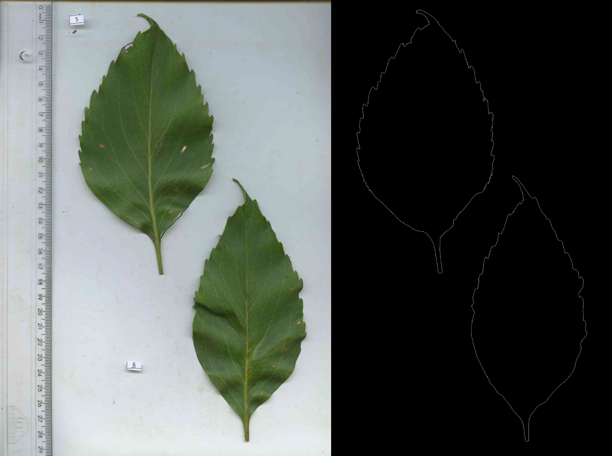

# Corte_calculo_area_foliar
Processa imagens de folhas escaneadas. Limpa as imagens, corta (caso haja mais de uma folha no mesmo arquivo), cria máscara em preto e branco e salva automaticamente. Calcula as áreas foliares (em cm²) e salva em arquivo ".txt". 
**Imagens para exemplo no arquivo <a href="https://github.com/ThiagoRBM/Corte_calculo_area_foliar/blob/main/FolhasInicial.rar">FolhasInicial.rar</a>**

Script feito por causa de demandas de amigos. **Dividido em partes**.

### Primeira parte: para processamento de imagens de folhas de plantas escaneadas. Contém funções para:
*arquivo: <a href="https://github.com/ThiagoRBM/Corte_calculo_area_foliar/blob/main/CorteFolhasV2.R">CorteFolhasV2.R</a>*

1. **cortePB**: Criar uma máscara em Preto e Branco a partir da imagem colorida.
2. **corteRegua**: Cortar objetos que servem de escala para a imagem. No caso que vivenciei, algumas imagens tinham uma régua de 30cm no lado esquerdo, que foi escaneada juntamente com as folhas para servir de escala. Essa função pode *apagar* a régua da imagem, deixando a área em que ela estava preta (**com o argumento Regua= "apagar"**) e portanto mantendo o número de pixels da imagem inicial ou essa função pode *remover* a régua (**com o argumento Regua= "cortar"**), cortando um pedaço da imagem e portanto reduzindo o número de pixels iniciais da imagem.
3. **corteFaixa**: Cortar faixas brancas da imagem. No caso que vivenciei, algumas imagens escaneadas tinham faixas em branco. Isso acontece quando o suporte para as folhas (que fica entre as folhas propriamente ditas e o vidro do escaner) é menor que a área do vidro do escaner. Ao criar a máscara em preto e branco, essas faixas ficam brancas e podem atrapalhar no cálculo da área foliar. Essa função corta essas faixas *(por enquanto, corta só faixas que estejam em cima ou embaixo nas imagens, não dos lados, mas posso adicionar essa funcionalidade)*. Assim como a funcao para cortar a régua, esta pode apenas *apagar*, deixando a região da faixa reta ou *cortar* a faixa, usando os argumentos **Faixa = "apagar"** ou **Faixa= "cortar"**, respectivamente.
4. **objetosNumero**: Função que numera os objetos presentes na imagem em preto e branco (com a função *bwlabel*) e seleciona os maiores objetos da imagem. Retorna um vetor com os numeros dos objetos (os números **não necessariamente serão sequenciais**). Essa função complementa a *bwlabel*, que retorna uma matriz com os objetos numerados.
5. **selecOBJT**: Recortar cada uma das folhas da imagem inicial e salvar em uma pasta.

As funções podem ser usadas separadamente, mas foram pensadas para ser usadas uma em seguida da outra. É importante acompanhar nos comentários presentes no script, que explica como usar cada função e o que cada uma faz.
Após as funções isoladas, coloquei um loop que usa todas as funções, na ordem, e pode ser usado em um diretório inteiro de uma vez, caso as imagens estejam padronizadas (por exemplo, com todas as escalas no mesmo lado). Caso as imagens não estejam padronizadas, é preciso fazer alterações no loop para levar isso em conta ou separar as imagens em diferentes diretórios (e.g., todas com régua na direita em um diretório, todas com régua a esquerda, em outro) antes de rodar o loop.
As imagens cortadas e em preto e branco são salvas em uma subpasta do diretório onde estão as imagens coloridas, chamado **Cortes**. O nome inicial da imagem é mantido e as folhas são numeradas uma a uma. Assim por exemplo, se o arquivo inicial chama "pequi.jpg" e nessa imagem tem duas folhas, os arquivos serão salvos como "pequi_folha_1_.jpg" e "pequi_folha_2_.jpg". 

No repositório existem imagens coloridas de exemplo. Abaixo, imagem inicial e como fica após usar as funções acma:

*Esquerda*: Imagem original, com régua de escala no lado esquerdo, uma faixa preta em cima e duas folhas de planta na mesma imagem. *Direita*: Cada folha separada em um arquivo diferente e transformadas em Preto e Branco, ao final do processamento.

---

### A segunda parte: para cálculo da área foliar, em cm²
*arquivo: <a href="https://github.com/ThiagoRBM/Corte_calculo_area_foliar/blob/main/CalculoAreaFoliar.R">CalculoAreaFoliar.R</a>*

1. **areaFoliar**: Calcula a área foliar (em cm²) e salva em um arquivo ".txt". É **importante** usar o valor de **DPI** (*dots per inch*) correto para o cálculo. Quando as imagens forem ser escaneadas, geralmente o usuário pode escolher esse valor. Se não souber qual é ele, clicar com o botão direito em uma imagem e ir em "detalhes". Lá esse valor é informado. **Contudo**, se a imagem foi processada em algum programa, dependendo do programa e do que tiver sido feito, esse valor de DPI terá sido alterado e para o cálculo correto, precisa ser usado o valor **inicial**, que foi usado para o escaneamento da imagem. O arquivo gerado tem uma coluna com o nome do arquivo onde o cálculo foi feito e uma coluna com a área, em cm² e fica salvo **no mesmo diretório** em que as imagens em preto e branco estiverem.

---

### A terceira parte: para extração do contorno das imagens
*arquivo: <a href="https://github.com/ThiagoRBM/Corte_calculo_area_foliar/blob/main/ContornoFolhas.R">ContornoFolhas.R</a>*

1. **removerSujeira**: remove sujeiras (pixels brancos isolados) de uma imagem em preto e branco. A função recebe uma imagem em preto com os objetos numerados e um vetor com os números que sejam referentes aos objetos de interesse. Pode ser usado por exemplo uma matriz resultado da função **bwlabel** como imagem numerada com o resultado da função **objetosNumero**, explicado acima, como o vetor. A imagem resultado de **bwlabel** vai identificar qualquer pixel isolado como um objeto novo (sendo os pixels unidos considerados como um mesmo objeto) e a funcao **objetosNumero** vai pegar só os maiores objetos e considerar como objetos "válidos". A função **removerSujeira** vai então considerar qualquer pixel que não tenha o número presente no vetor como sujeira e irá apagá-lo.
2. **extrairContorno**: com base na função **ocontour**, extrai os contornos da imagem em preto e branco com objetos numerados (e preferencialmente limpa) e remonta a imagem.

*Esquerda*: Imagem original, com régua de escala no lado esquerdo, uma faixa preta em cima e duas folhas de planta na mesma imagem. Reparar em quadrados de papel com numeração inicial das folhas *Direita*: Contorno das duas folhas **com os quadrado de numeração, régua e faixa removidos**, ao final do processamento.

#### *O arquivo: <a href="https://github.com/ThiagoRBM/Corte_calculo_area_foliar/blob/main/FuncoesScripts.R">FuncoesScripts.R</a> contem todas as funções dos scripts acima separadas, sem exemplos nem explicações, caso seja útil*. Elas podem ser carregadas diratamente em outro script usando o comando *source("caminho_em_que_está_salvo")*.
